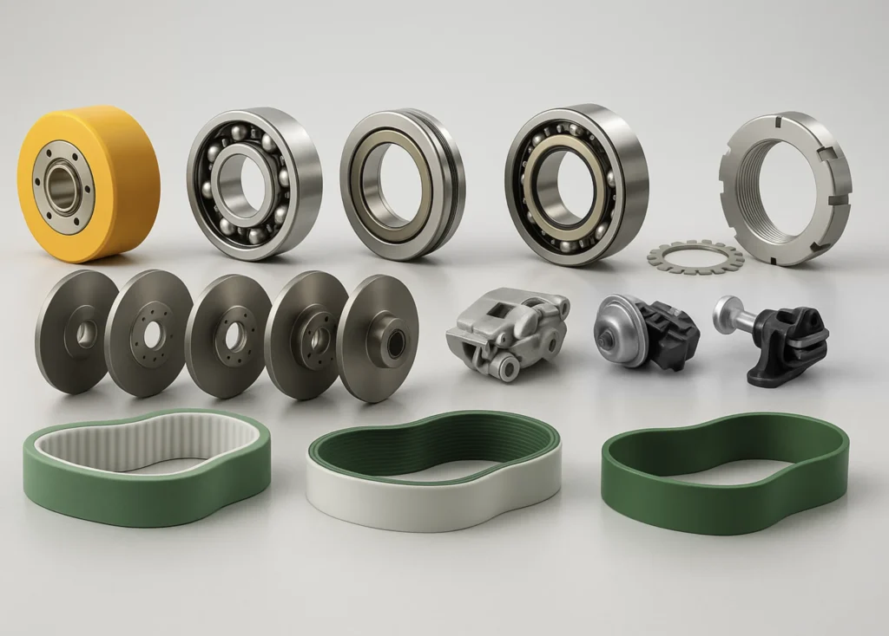
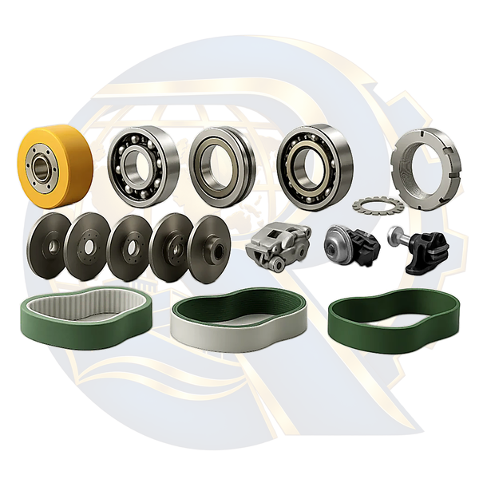

# Radvinex AI Product Image Processor

AI-assisted batch processing for e-commerce product photography: remove backgrounds, enhance low-resolution images, and produce consistent **600 × 600 transparent PNGs** with a subtle Radvinex logo watermark.

## Before & After

| Original input | Processed output |
|:---:|:---:|
|  |  |
| `products/Mechanical-Parts.webp` | `output/Mechanical-Parts.png` |

> The preview images above are sample files committed to this repository. Results vary by source image.

## Features

- Combines three background-removal models through `rembg`: **BiRefNet General**, **BiRefNet Massive**, and **ISNet General Use**.
- Attempts to preserve small product details when merging AI masks.
- Accepts JPG, JPEG, PNG, WebP, BMP, TIF and TIFF inputs.
- Exports **600 × 600 px transparent PNGs**, retaining a **20 px** maximum product margin.
- Places a full-canvas logo watermark behind the product at **10% opacity** (transparent areas of the logo stay transparent).
- Attempts **Real-ESRGAN ×4** restoration on low-resolution images; uses Pillow enhancement as a fallback if restoration is unavailable.
- Processes multiple input images automatically.

## Requirements

- Python and a working internet connection for initial dependency and AI model downloads.
- Sufficient disk space and RAM for AI models. GPU acceleration is optional; CPU processing may be slow.

Dependencies can be installed explicitly:

```bash
python -m pip install -r requirements.txt
```

The script also attempts to install missing dependencies on startup. AI packages and model weights can be large. Compatibility and full inference have **not** been validated on every Python/OS configuration.

## Usage

1. Put source images in `products/`.
2. Keep `logo.png` alongside `main.py`, or replace it with your own authorized logo.
3. Run the program from the project directory:

```bash
python main.py
```

4. Find processed images in `output/`, with matching basenames and a `.png` extension.

## Project structure

```text
radvinex-ai-product-image-processor/
├── main.py
├── logo.png
├── requirements.txt
├── README.md
├── .gitignore
├── products/
│   └── Mechanical-Parts.webp     # sample input
└── output/
    └── Mechanical-Parts.png      # sample output
```

Other product photos and generated images can be kept local. The `.gitkeep` files allow directories to remain represented in Git.

## Configuration

Edit the constants at the top of `main.py`, including:

- `CANVAS_SIZE = (600, 600)`
- `PRODUCT_PADDING = 20`
- `LOGO_OPACITY = 0.10`
- `AI_SUPER_RESOLUTION = True`
- `SAVE_DEBUG_MASKS = False`

**Note:** AI restoration can reconstruct or alter tiny text and fine mechanical details. Check processed images before publishing them as technical product references.

## License & brand assets

No open-source license has been assigned to this repository. Public visibility alone does not grant permission to reuse the code or the Radvinex logo. If you want to encourage reuse, add a deliberate software license and clarify the rights for brand assets.

---

## راهنمای فارسی

**Radvinex AI Product Image Processor** ابزاری برای آماده‌سازی گروهی تصاویر محصولات فروشگاهی و صنعتی است.

- حذف پس‌زمینه با ترکیب سه مدل هوش مصنوعی
- تلاش برای بازسازی عکس‌های کم‌کیفیت با Real-ESRGAN
- تولید PNG شفاف با ابعاد ۶۰۰ در ۶۰۰ پیکسل
- حاشیه محصول ۲۰ پیکسل و واترمارک لوگو با شفافیت ۱۰ درصد
- دریافت فایل‌ها از پوشه `products` و ذخیره خروجی در `output`

برای اجرا:

```bash
python -m pip install -r requirements.txt
python main.py
```

تصاویر نمونه قبل و بعد در ابتدای همین صفحه نمایش داده شده‌اند. اجرای کامل مدل‌های هوش مصنوعی در همه محیط‌ها تضمین نشده و ممکن است در اجرای اول به اینترنت و منابع سخت‌افزاری بیشتری نیاز باشد.
